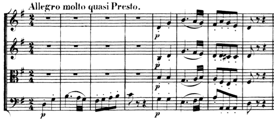

{{ page.title }}
================

Hybrid themes generally combine the features of sentences and periods.

## Hybrid 1 ##

Hybrid 1 combines the antecedent phrase (typically associated with the period) with the continuation phrase (typically associated with the sentence).

![][hybrid1]

This results in a complete presentation–continuation–cadential function progression in the antecedent phrase followed by an incomplete continuation–cadential function progression. On the large scale, the antecedent phrase functions like a big presentation function zone (like the presentation phrase does).

A prototypical example can be found in Mozart's Piano Sonata in C major, II., mm. 1–8.

## Hybrid 2 ##

Hybrid 2 similarly begins with an antecedent phrase, but follows with a four-bar-long cadential progression.

![][hybrid2]

A prototypical example can be found in Haydn's String Quartet in G major, Hob. III:66, II., mm. 1–8.

## Hybrid 3 ##

Hybrid 3 is almost identical to Hybrid 1, with the exception that the first phrase does not end with a cadence. This "compound basic idea" (CBI) presents the melodic structure of an antecedent (two contrasting melodic ideas), but uses the harmonic structure of a presentation phrase (tonic prolongation). The CBI expresses presentation function, followed by a continuation phrase that expresses continuation and cadential functions.

![][hybrid3]

A prototypical example can be found in Haydn's Piano Sonata in C major, Hob. XVI:35, I., mm. 1–8.

## Hybrid 4 ##

Hybrid 4 is almost identical to a period, with the exception that the first phrase does not end with a cadence. The CBI expresses presentation function, which is picked up in the beginning of the consequent phrase that contains the basic idea, and possibly tonic harmony, as well. Continuation and cadential function do not appear until the last contrasting idea (CI).

![][hybrid4]

A prototypical example can be found in Beethoven's String Quartet in G major, Op. 18/2, IV., mm. 1–8.

[hybrid1]: Graphics/ClassicalThemes/hybrid1.png
[hybrid2]: Graphics/ClassicalThemes/hybrid2.png
[hybrid3]: Graphics/ClassicalThemes/hybrid3.png
[hybrid4]: Graphics/ClassicalThemes/hybrid4.png
