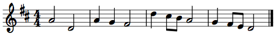
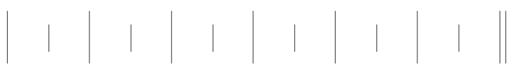
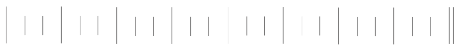
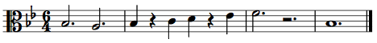

{{ page.title }}
================

*Protonotation* is a system of musical notation stripped of complicating elements, and focusing only on basic elements of meter, rhythm, and scale degree. (This system is drawn from Gary Karpinski's *Manual for Ear Training and Sight Singing*.) Following is an example melody in both standard notation and protonotation (click images to view full size).

Note that protonotation does not contain information about *tonic*, nor the *duration of the beat* (nor, by extension, the bottom number of the time signatures). It only represents the pitch and rhythm elements that can be heard by someone without absolute pitch: meter, rhythm, and scale degree. (Mode—major or minor—can be inferred from the scale degrees.) Since it only represents what can be heard, without any additional notational factors, it is a helpful system for practicing rhythmic dictation, melodic dictation, and sight-singing.

## Elements of protonotation ##

Following are blank protonotation grids for duple, triple, and quadruple meters.

*Duple meter:*  
  

*Triple meter:*  
  

*Quadruple meter:*  
  

In duple and triple meter, downbeats are represented by longer vertical lines, and weak beats are represented by shorter vertical lines. In quadruple meter, the third beat of each bar is of medium strength, so it is represented by a medium-length line.

Notes are notated by using horizontal lines for rhythmic duration and moveable-*do* solfège syllables for scale degree. Arrows are used to denote the direction of any melodic leaps. (Arrows are not necessary for stepwise progressions.)

Rests are represented by the lack of horizonal line in a given beat or part of a beat. When using protonotation for transcription or dictation, however, it can be helpful to use an **X** instead of a blank, so you can distinguish a rest you are sure about from a part of the music you have left blank because you have not yet determined what is going on at that moment.

## Converting protonotation to staff notation ##

Protonotation is not enough to produce staff notation. However, if you know 1) the clef, 2) the tonic pitch, and 3) either the beat duration or bottom number of the time signature, you can convert it to staff notation easily.

First, draw the clef provided (or choose an appropriate one based on your perception of the register of the melody) and determine the key signature from the tonic provided and the mode you heard. (Look through your melody for *mi* v. *me*.)

Then, determine the time signature from the beat value/bottom number provided and from the meter refelected in your protonotation. (Review [the relationship of meter to time signature](meter.html), if necessary.) If no bottom number is provided, choose a convenient one (**4** for simple meters and **8** for compound meters are the most typical).

Next, each of the long protonotation lines become barlines in staff notation.

Finally insert the notes into each bar. The register, solfège syllable, and tonic will determine the pitch class. The rhythmic value will be determined by the duration of the note in beats and what the time signature implies about the duration of the beat, For example, a two-beat note in 4/4 is a half note (2 x quarter-note beat); in 2/2 is a whole note (2 x half-note beat); in 9/8 is a dotted half note (2 x dotted-quarter-note beat); and in 6/4 is a dotted whole note (2 x dotted-half-note beat).

Following are additional examples.

**Example 1.**  

Bass clef, tonic: G, bottom number: 8.  

Alto clef, tonic: B-flat, bottom number: 4.

**Example 2.**  

Treble clef, tonic: E-flat, bottom number: 4.  

Tenor clef, tonic: C-sharp, bottom number: 8.

Bass clef, tonic: F, bottom number: 1.

